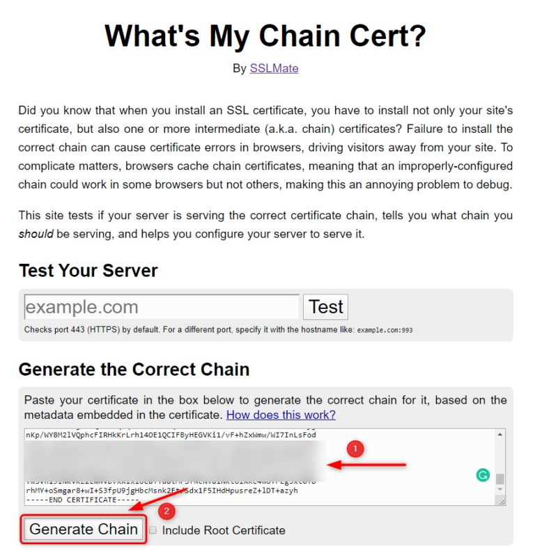

# 如何修复 Incomplete Certificate Chain 引起的 SSL handshake_failure？

前两天，运维更换了服务器的 SSL 证书，使用浏览器访问网站是正常的，但是使用 Java 代码访问，却会抛出 “Received fatal alert: handshake_failure” 异常。经过检查，发现是因为证书链不完整导致的。本文将介绍如何修复 Incomplete Certificate Chain 引起的 SSL handshake_failure 错误。

## SSL 信任链简介

首先，了解证书颁发机构（CA）的概念至关重要。CA 是那些负责发放和管理数字安全证书（如 SSL/TLS 证书）的组织。这些机构（例如 DigiCert、Comodo 等）是被广泛信任的第三方，它们的数字证书用于在互联网上安全验证实体（如公司、网站等）的身份。当讨论 CA、根证书、中间证书以及 SSL 证书的链接方式时，我们实际上是在讨论“SSL 信任链”。

SSL 信任链是一系列有序的证书，它允许终端用户的客户端（如网页浏览器）确认网站的服务器（即发送方）及证书颁发机构的可靠性。

## 为何会出现不完整的证书链警告？

不完整的证书链警告通常在以下情况下出现：

- **自定义 SSL 证书部署**：部署自定义 SSL 证书时，需要确保同时添加网站的 SSL 证书和中间证书（某些情况下还需添加私钥）。如果遗漏了中间证书或安装了错误的证书，将导致证书链不完整，浏览器可能会显示 Incomplete Certificate Chain 或 Broken SSL Chain 类似的警告；也可能不会显示任何警告，因为浏览器会自动查询或下载中间证书。
- **中间证书失效**：如果中间证书因撤销或过期而失效，也可能出现这样的警告。

## 识别不完整的证书链警告

验证 SSL 证书并检查是否存在链断裂问题至关重要。即使浏览器没有显示此类警告，访问者仍可能看到它们。因此，及时识别并解决这一问题，以保护访问者和网站的安全，是非常重要的。

### 使用 Qualys SSL Labs 检测

推荐使用第三方 SSL 检测工具，如 [Qualys SSL Labs](https://www.ssllabs.com/ssltest/analyze.html)，来检测 SSL 证书链是否断裂。


### 使用 curl 命令检测

使用 curl 命令检测 SSL 证书链是否完整：

```bash
curl -I 'https://api.billgun.com/'
curl: (60) server certificate verification failed. CAfile: /etc/ssl/certs/ca-certificates.crt CRLfile: none
More details here: http://curl.haxx.se/docs/sslcerts.html
```

### 使用 openssl 命令检测

使用 openssl 命令检测 SSL 证书链是否完整：

```bash
openssl s_client -connect api.billgun.com:443
CONNECTED(00000003)
depth=0 OU = Domain Control Validated, OU = PositiveSSL Wildcard, CN = *.billgun.com
verify error:num=20:unable to get local issuer certificate
verify return:1
depth=0 OU = Domain Control Validated, OU = PositiveSSL Wildcard, CN = *.billgun.com
verify error:num=21:unable to verify the first certificate
verify return:1
---
Certificate chain
 0 s:/OU=Domain Control Validated/OU=PositiveSSL Wildcard/CN=*.billgun.com
   i:/C=GB/ST=Greater Manchester/L=Salford/O=COMODO CA Limited/CN=COMODO RSA     Domain Validation Secure Server CA
---
```

## 修复不完整的证书链警告

1. **检查并更新证书**：如果是在云服务商处购买的 SSL 证书，可以尝试重新下载证书，确保包含了中间证书。如果是自定义 SSL 证书，确保同时添加网站的 SSL 证书和中间证书。
2. **使用第三方工具生成中间证书**：推荐 [What’sMy Chain Cert](https://whatsmychaincert.com/)。访问网站后，首先粘贴 SSL 证书（.crt/.cer 文件）内容，然后点击“生成链”，如下面的截图所示。


## 验证 SSL 证书

在解决了 SSL 证书链的问题之后，使用前述工具重新检测网站，确保所有证书都已正确配置，链条完整即可。
